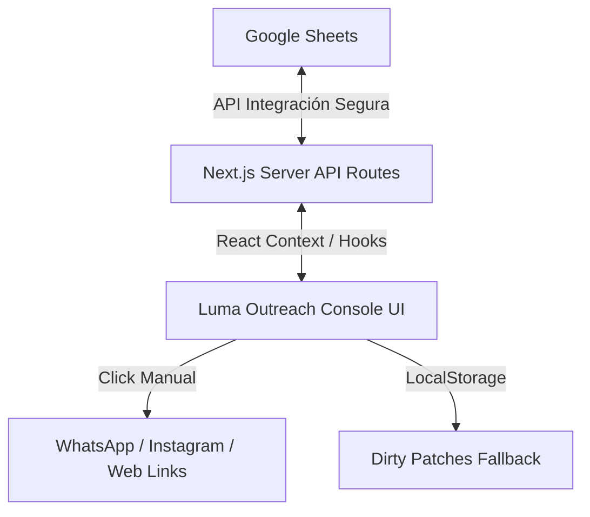

# 44 - Luma Outreach v1 Release Lock

**Fecha:** 2026-05-23  
**Versión:** 1.0.0 (Release Lock)  
**Estado:** Producción Estable  
**Autor:** Product Systems Architect & Senior Product Engineer  

Este documento establece el estado final del lanzamiento de la versión 1.0.0 (v1) de **Luma Outreach Console**. Define de manera estricta el perímetro funcional, las exclusiones de alcance, el checklist final de calidad (QA) y los criterios técnicos de estabilidad para el cierre formal del proyecto.

---

## 1. Estado Final de la Versión

La versión v1.0.0 es una **cabina de prospección comercial de alto rendimiento (High-Ticket)**, diseñada específicamente para el flujo operativo diario de Marcos Hilario. Su objetivo principal es concentrar y agilizar el contacto manual con prospectos calificados reduciendo la fricción visual y organizativa de la base de datos de Sheets.

### Arquitectura de Sistema

---

## 2. Qué Quedó Funcionando (Perímetro Funcional)

El sistema ha sido validado bajo un entorno estricto de compilación de Next.js y cuenta con las siguientes capacidades activas:

1. **Sincronización Bidireccional Manual-Safe**:
   * Descarga masiva del estado de Sheets a través de `/api/sheets/leads`.
   * Envío selectivo de actualizaciones unitarias a través de `/api/sheets/update-lead`.
   * Manejo de *dirty patches* (cambios pendientes locales) almacenados en `localStorage` que evitan la pérdida de datos en caso de desconexión.
2. **Command Center (Cabina de Mando)**:
   * **KPIs Principales**: Visualización premium a escala completa de Leads Totales, Listos, Contactados Hoy y la Meta Mensual.
   * **Fila de Métricas Secundarias**: Estado compacto en hover para el seguimiento del embudo (Respuestas, Interesados, Llamadas y Propuestas).
   * **Runway Comercial y Capacidad**: Indicador de progreso visualizado para el control del volumen diario.
3. **Estructura Estructural Fija (LeadDetailDrawer)**:
   * Header de identidad del lead fijo.
   * Tabs de navegación fija sin scroll horizontal.
   * Cuerpo de información independiente con scroll vertical.
   * Footer fijo con botones de acción principal (Copy, WhatsApp, Outcome, Guardar).
4. **Tarjetas de Lead Optimizadas (`LeadOperationalCard`)**:
   * Diseño simplificado: colapsado de los paneles pesados de mensaje recomendado y outcome por defecto (revelados bajo interacción "Ver datos completos").
   * Next Step Card estilizada con gradiente dorado de alta gama.
   * Botones de acción organizados jerárquicamente.
5. **Pipeline de Propuestas (Tablero Kanban)**:
   * Grid horizontal responsivo de 4 columnas (`Por enviar`, `Enviadas`, `Negociación`, `Cerradas y Perdidas`).
   * Tarjetas verticales ultra-compactas con badges de nicho, ticket comercial y accesos rápidos a demos o propuestas.
6. **Configuración de Nichos**:
   * Segmentación por tabs funcionales que cargan dinámicamente prospectos basados en nicho/industria.

---

## 3. Qué Quedó Fuera del Alcance (Exclusiones de la v1)

Para mantener la seguridad y fiabilidad operativa, las siguientes funciones han sido excluidas intencionalmente del código y diseño de la v1:

* **Envío automático de mensajes**: No existen scripts automáticos de envío por API de WhatsApp ni emulación de clicks para evitar baneos de cuentas de Marcos.
* **Scraping automático**: No se realiza recolección automática de datos de redes sociales en el cliente. Luma Intelligence Hub se mantiene como el sistema autónomo encargado del scraping previo.
* **Inteligencia Artificial integrada en tiempo real**: La consola no conecta de forma directa con APIs externas de LLMs (ej. OpenAI, DeepSeek) durante el flujo operativo de Marcos. Los mensajes preestablecidos provienen del catálogo precargado y la base de datos de Sheets.
* **Autenticación multiusuario compleja**: El sistema está optimizado para un único operador (Marcos) bajo el slug de workspace seguro.

---

## 4. Checklist de Control de Calidad (QA)

Antes de cualquier despliegue posterior o congelamiento definitivo de la versión, debe ejecutarse la siguiente matriz de pruebas:

| Categoría | Elemento de Prueba | Acción / Validación | Resultado Esperado |
| :--- | :--- | :--- | :--- |
| **Estructura** | Layout Multipanel | Cargar `/console/[workspaceSlug]` y desplazar verticalmente. | El menú lateral (Sidebar) se mantiene fijo; la página no scrollea en masa. |
| **Estructura** | LeadDetailDrawer | Abrir un lead y cambiar de pestañas en móvil y escritorio. | Las tabs y el footer de guardar no se mueven ni se ocultan. |
| **Sincronización** | Carga de Sheets | Clic en "Sincronizar desde Google Sheets". | Se genera una barra de progreso exitosa y la lista de leads se actualiza. |
| **Sincronización** | Guardar en Sheets | Realizar un cambio de outcome y hacer clic en "Guardar en Sheets". | La notificación tipo Toast confirma la escritura y el indicador de cambios pendientes vuelve a cero. |
| **Visual** | Tablero Kanban | Navegar a la pestaña "Propuestas" en escritorio. | Las 4 columnas se alinean horizontalmente sin barra de desplazamiento en la parte inferior de la pantalla. |
| **Visual** | Tarjeta Kanban | Verificar tarjetas de propuesta. | Se muestran compactas con el ticket comercial, el nicho y los botones de acción sin solapamiento de textos. |

---

## 5. Criterios de Estabilidad de la v1.0.0

Para dar por concluido el ciclo de desarrollo de la v1 y considerar estable la versión, el proyecto debe cumplir rigurosamente los siguientes tres criterios:

1. **Cero Errores de Tipado en Compilación**:
   * La ejecución del comando `npm run build` debe finalizar con el estado: `✓ Compiled successfully`.
   * El chequeo de TypeScript no debe arrojar advertencias ni errores (`any` no permitido en el código de integración de Sheets).
2. **Cero Exposición de Credenciales**:
   * No deben existir archivos de variables de entorno en el control de versiones git.
   * La inicialización de `googleSheets.ts` debe fallar de forma segura si las variables no están inyectadas a nivel de servidor, sin filtrar llaves privadas al frontend.
3. **Resiliencia ante Caídas de Conexión (Offline Ready)**:
   * Si el servidor de Google Sheets responde con error `500` o `Timeout`, la interfaz debe notificar el error visualmente pero **mantener** el estado del prospecto en la cola de cambios locales pendientes del navegador.
