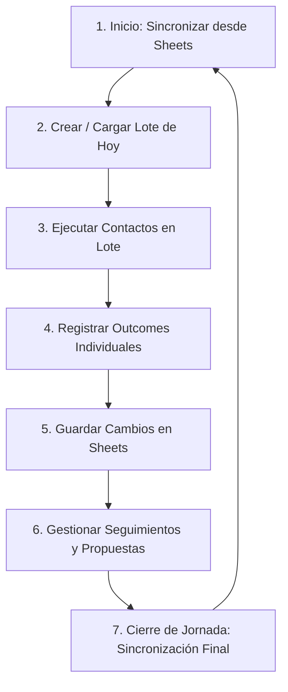

# 46 - Luma Outreach v1 Operating Manual

**Fecha:** 2026-05-23  
**Para:** Marcos Hilario (Operador Comercial Principal)  
**Proyecto:** Luma Outreach Console v1  

Este manual describe detalladamente la rutina operativa diaria y el uso correcto de la consola Luma Outreach. El objetivo es asegurar que la gestión comercial sea eficiente, ordenada y que la información en Google Sheets refleje fielmente la realidad en tiempo real.

---

## Rutina Diaria del Operador (Marcos Hilario)

El siguiente diagrama ilustra el flujo de trabajo circular que Marcos debe seguir cada día:

---

## 1. Sincronizar desde Sheets (Inicio de Jornada)

Antes de iniciar cualquier acción de contacto, debes actualizar la consola con los datos más recientes de la hoja de cálculo.

1. Abre la aplicación **Luma Outreach Console** en tu navegador.
2. En la barra de estado superior o en la pestaña de sincronización, haz clic en el botón **"Sincronizar desde Google Sheets"**.
3. Espera a que termine la barra de carga. Al finalizar, aparecerá una notificación (Toast) indicando la cantidad de leads actualizados y la hora exacta de la última sincronización.
4. *Nota de seguridad:* Si la sincronización falla, comprueba tu conexión a internet. No intentes operar con datos locales obsoletos si estás fuera de línea.

---

## 2. Crear el Lote de Hoy

El "Lote de Hoy" es tu lista de trabajo enfocada del día. Evita que te disperses navegando por cientos de prospectos.

1. Ve a la pestaña **"Prospectos"** o **"Nichos"**.
2. Filtra por la industria o nicho que desees trabajar hoy (ej. *Real Estate*, *Beauty*).
3. Selecciona los prospectos marcando las casillas ubicadas a la izquierda de cada tarjeta.
4. En la barra de acciones masivas superior, haz clic en **"Crear lote de hoy"**.
5. Ve a la pestaña **"Lote de Hoy"** en el menú de navegación lateral. Verás únicamente los prospectos que acabas de agregar, ordenados por prioridad de contacto.

---

## 3. Contactar y Copiar Mensajes

La consola te ayuda a preparar el mensaje personalizado sin tener que redactarlo desde cero.

1. En la lista del **Lote de Hoy**, selecciona el primer prospecto de la lista.
2. Haz clic en **"Ver datos completos"** en la tarjeta del lead.
3. Se desplegará el panel con la información comercial completa y la sección de **"Mensaje recomendado"** (con las variables del negocio ya inyectadas).
4. Haz clic en el botón dorado **"Copiar mensaje"**. El texto se guardará automáticamente en tu portapapeles.
5. Haz clic en el botón **"Abrir WhatsApp"** (o Instagram, según el canal recomendado). Se abrirá la aplicación correspondiente con el chat del prospecto listo.
6. Pega el mensaje en el chat, haz los ajustes personales que consideres necesarios y **envíalo manualmente**.

---

## 4. Registrar el Outcome (Resultado del Contacto)

Inmediatamente después de enviar el mensaje, debes registrar qué sucedió para mantener el control del pipeline.

1. Regresa a la consola Luma Outreach.
2. En la tarjeta del prospecto que acabas de contactar, localiza la barra de resultados: **"¿Qué pasó con este contacto?"**.
3. Selecciona una de las siguientes opciones según el resultado real:
   * **Respondió**: Si el prospecto ya contestó y muestra interés inicial.
   * **No respondió**: Si enviaste el mensaje pero aún no hay lectura ni respuesta.
   * **Visto / sin respuesta**: El mensaje fue leído pero no hubo contestación.
   * **Programar seguimiento**: Si acordaron hablar en otra fecha (se abrirá un selector de fecha en el drawer).
   * **No interesado**: Si rechazó formalmente la propuesta.
   * **Sin acción por ahora**: Para congelar temporalmente el lead.

---

## 5. Guardar Cambios en Sheets

Los cambios de outcome y notas se guardan en la memoria local de la consola de forma temporal. **Debes enviarlos a Google Sheets para que queden registrados permanentemente**.

1. Notarás un indicador en pantalla que muestra el número de cambios pendientes por guardar (ej. *"Tienes 3 cambios sin guardar"*).
2. Haz clic en el botón dorado **"Guardar en Sheets"**.
3. Espera a recibir la confirmación de guardado. El contador de cambios pendientes volverá a `0`.
4. *Consejo práctico:* Guarda tus cambios cada 3 o 4 contactos realizados para evitar acumular demasiados cambios en la memoria del navegador.

---

## 6. Seguimiento de Prospectos

No dejes que los leads calificados se enfríen. Revisa diariamente los seguimientos agendados.

1. Ve a la pestaña **"Seguimiento"** en el menú lateral.
2. La consola te mostrará una lista de prospectos cuya **Fecha de seguimiento** es igual o anterior al día de hoy (seguimientos vencidos o activos).
3. Abre la tarjeta del lead, revisa las notas previas del drawer de detalles para recordar el contexto de la última conversación.
4. Envía un mensaje de seguimiento, registra el nuevo outcome y vuelve a guardar en Sheets.

---

## 7. Pipeline de Propuestas

Cuando un lead pasa a etapa de negociación, debes gestionar su propuesta comercial formal.

1. Abre el drawer de detalles del prospecto.
2. En la pestaña de propuestas, registra el **Ticket sugerido** ($USD) y la **Oferta recomendada**.
3. Coloca el enlace del material de apoyo o video demo en el campo correspondiente.
4. Genera el enlace de la propuesta comercial formal (ej. link de presentación o Notion) y regístralo.
5. Cambia el estado del prospecto a `Propuesta Enviada` o `En Negociación`.
6. En la pestaña general de **"Propuestas"** (Tablero Kanban), podrás ver y arrastrar visualmente al prospecto a lo largo de las 4 etapas del pipeline comercial (`Por enviar` -> `Enviadas` -> `Negociación` -> `Cerradas y Perdidas`).

---

## 8. Cierre de Jornada

Antes de cerrar la consola por completo al finalizar tu día de trabajo:

1. Revisa que el indicador de cambios pendientes esté en **cero**. Si hay cambios pendientes, haz clic en **"Guardar en Sheets"**.
2. Realiza una última sincronización haciendo clic en **"Sincronizar desde Google Sheets"** para asegurarte de que todo el embudo esté limpio y sin conflictos.
3. Cierra la pestaña del navegador con la tranquilidad de que tu base de datos central en Google Sheets está perfectamente actualizada para el día siguiente.
